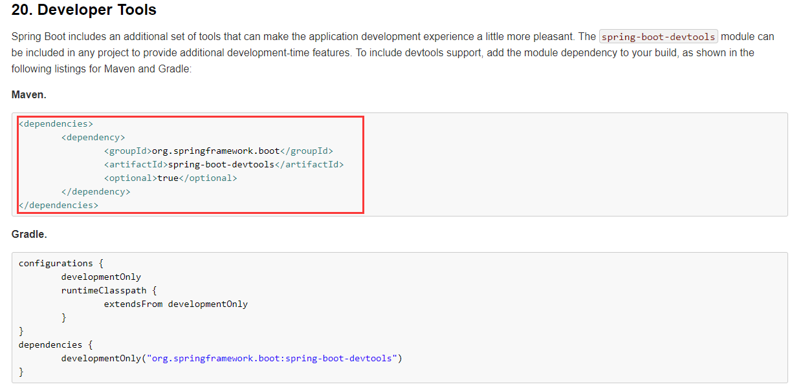
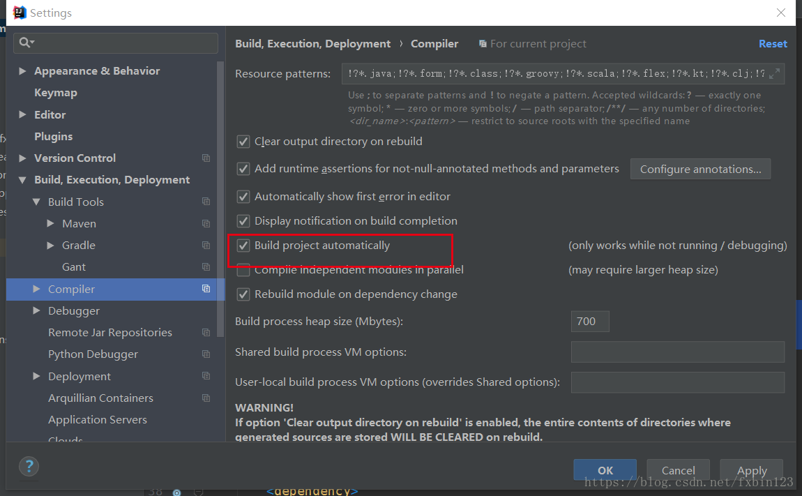
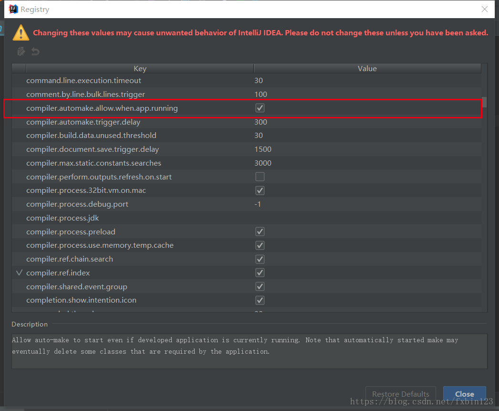

# spring boot 学习


## spring-boot-04-web-restfulcrud

### 32.视频链接：https://www.bilibili.com/video/av23478787/?p=32

**注意事项**：

1. 版本：

   thymeleaf注入自定义版本

   ```xml
   <thymeleaf.version>3.0.10.RELEASE</thymeleaf.version>
   	<!-- 布局功能的支持程序  thymeleaf3主程序  layout2以上版本 -->
   	<!-- thymeleaf2   layout1-->
   <thymeleaf-layout-dialect.version>2.2.2</thymeleaf-layout-dialect.version>
   ```

2. 注意：

- Controller中使用@Controller注释，不要使用@RestController注释 （springboot版本2.0需要特别注意）
- 方法代码中也不要加@ResponseBoby ,估计返回的不需要是json格式


### 33.视频链接：https://www.bilibili.com/video/av23478787/?p=33

**注意事项：**

```java
//WebMvcConfigurerAdapter 已经启用，使用WebMvcConfigurer 接口，进行实现
public class MyMvcConfig implements WebMvcConfigurer {
    //使用WebMvcConfigurerAdapter可以来扩展SpringMVC的功能
    @Override
    public void addViewControllers(ViewControllerRegistry registry) {
//        super.addViewControllers(registry);
        registry.addViewController("abc").setViewName("success");
    }
```


### 35.视频链接：https://www.bilibili.com/video/av23478787/?p=35

**注意事项：**配置application.properties文件

```xml
spring.messages.basename=i18n.login
```

新建一个配置类
```java
package com.sly.springboot.Config;

import org.springframework.util.StringUtils;
import org.springframework.web.servlet.LocaleResolver;

import javax.servlet.http.HttpServletRequest;
import javax.servlet.http.HttpServletResponse;
import java.util.Locale;

/**
 * 可以在连接上携带区域信息
 *
 * */
public class MyLocalResolver implements LocaleResolver {

    @Override
    public Locale resolveLocale(HttpServletRequest request) {
        String l = request.getParameter("l");
        Locale locale = null;
        if (!StringUtils.isEmpty(l)){
            String[] split = l.split("_");
            locale = new Locale(split[0],split[1]);
        }
        return locale;
    }

    @Override
    public void setLocale(HttpServletRequest httpServletRequest, HttpServletResponse httpServletResponse, Locale locale) {

    }
}

```

在MvcConfig中使用自己写的LocaleResolver（带参数则使用参数中的，不带则使用系统的）

```java
    @Bean
    public LocaleResolver localeResolver(){
        return new MyLocalResolver();
    }
```


### 109.视频链接：https://www.bilibili.com/video/av23478787/?p=35

**Title**：尚硅谷-SpringBoot高级-热部署-devtools开发热部署

1. [参考官方文档](https://docs.spring.io/spring-boot/docs/2.0.6.RELEASE/reference/htmlsingle/) 导入devtools依赖

   

   ```xml
   <dependency>
   	<groupId>org.springframework.boot</groupId>
   	<artifactId>spring-boot-devtools</artifactId>
   	<optional>true</optional>
   </dependency>
   
   ```

2. IntelliJ IDEA 设置  File ——> Settings ——> Complier ——> 选中 Build project automatically 

   


3.使用该组合键 Shift+ALT+Ctrl+/ ，选择 Registry 

勾选 “complier.automake.allow.when.app.running” 选项




